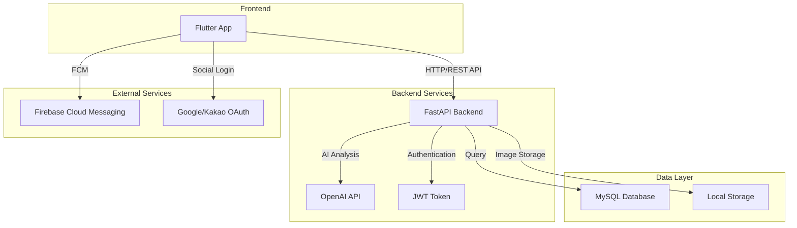

# TTM (Tap To Me)

**개인 맞춤형 건강 관리 애플리케이션**

> Flutter + FastAPI + MySQL 기반 크로스 플랫폼 헬스케어 앱

식단, 운동, 건강 정보를 통합 관리하는 종합 헬스케어 플랫폼

[](https://flutter.dev)
[](https://fastapi.tiangolo.com)
[](https://www.mysql.com)

---

## 시스템 아키텍처



---

## 빠른 시작

### 문서

- [Frontend 가이드](lib/FRONTEND_GUIDE.md) - Flutter 개발 완벽 가이드
- [Backend 가이드](backend/BACKEND_GUIDE.md) - FastAPI 서버 설정 및 API 문서
- [FCM 설정](FCM_SETUP_GUIDE.md) - 푸시 알림 설정
- [소셜 로그인](SOCIAL_LOGIN_SETUP.md) - 구글/카카오 로그인 설정

### 개발 환경 설정

```bash
# 1. 저장소 클론
git clone https://github.com/your-username/ttm.git
cd ttm

# 2. Backend 설정 (별도 터미널)
cd backend
python -m venv venv
.\venv\Scripts\Activate.ps1  # Windows
pip install -r requirements.txt
python main.py  # http://localhost:3000

# 3. Frontend 실행
flutter pub get
flutter run
```

---

## 주요 기능

### 식단 관리

- 아침/점심/저녁/간식 기록
- **AI 이미지 분석** - 음식 사진으로 자동 영양소 계산
- 식품별 영양 정보 (칼로리, 단백질, 탄수화물, 지방)
- 일일/주간/월간 칼로리 추적

### 운동 관리

- 운동 종류 및 시간 기록
- 소모 칼로리 자동 계산
- 운동 강도 설정 (낮음/보통/높음)
- 운동 통계 및 목표 설정

### 커뮤니티

- 운동 기록 및 식단 공유
- 게시물 좋아요 및 댓글
- 이미지 다중 업로드 지원
- 카테고리별 필터링

### 배지 시스템

- 20종 배지 (피트니스 러너, 얼리버드, 마라토너 등)
- 달성 조건별 자동 수여
- 배지 수집 현황 확인

### 건강 정보 관리

- 질병 정보 등록 및 관리
- 알레르기 정보 등록 및 AI 식단 경고
- 체중 변화 추적

---

## 기술 스택

### Frontend

- **Flutter** 3.x - 크로스 플랫폼 UI
- **Provider** - 상태 관리
- **HTTP** - REST API 통신
- **SharedPreferences** - 로컬 캐싱

### Backend

- **FastAPI** 0.115.6 - Python 웹 프레임워크
- **MySQL** 8.0 - 관계형 데이터베이스
- **JWT** - 토큰 인증
- **OpenAI** - AI 음식 분석

### DevOps

- **Git** - 버전 관리
- **VS Code** - IDE
- **Firebase** - FCM 푸시 알림

---

## 프로젝트 구조

```
ttm/
├── lib/                    # Flutter 앱
│   ├── models/             # 데이터 모델 (9개)
│   ├── services/           # API 서비스 (11개)
│   ├── screens/            # 화면 UI
│   ├── providers/          # 상태 관리
│   ├── widgets/            # 재사용 위젯
│   ├── constants/          # 상수 정의
│   ├── utils/              # 유틸리티
│   ├── FRONTEND_GUIDE.md   # Frontend 개발 가이드
│   └── main.dart
│
├── backend/                # FastAPI 서버
│   ├── routers/            # API 라우터 (11개, 60개 엔드포인트)
│   ├── services/           # 비즈니스 로직
│   ├── config/             # 설정
│   ├── database/           # SQL 스크립트
│   ├── utilities/          # 유틸리티 스크립트
│   ├── BACKEND_GUIDE.md    # Backend 개발 가이드
│   └── main.py
│
├── docs/                   # 개발 문서
├── assets/                 # 이미지, 폰트
└── README.md               # 이 파일

```

---

## 시작하기

### 필수 요구사항

- Flutter SDK 3.0+
- Python 3.11+
- MySQL 8.0+

### 1. Backend 설정 및 실행

```bash
# 1. backend 폴더로 이동
cd backend

# 2. 가상환경 생성 및 활성화
python -m venv venv
.\venv\Scripts\Activate.ps1  # Windows PowerShell

# 3. 패키지 설치
pip install -r requirements.txt

# 4. 환경 변수 설정 (.env 파일)
# DB_HOST, DB_USER, DB_PASSWORD 등 설정

# 5. MySQL 데이터베이스 생성
mysql -h <host> -P <port> -u <user> -p
CREATE DATABASE ttm_db;
USE ttm_db;
SOURCE database/schema.sql;

# 6. 서버 실행
python main.py
# http://localhost:3000 에서 실행됨
```

### 2. Frontend 설정 및 실행

```bash
# 1. 루트 폴더에서
flutter pub get

# 2. 앱 실행
flutter run

# 또는 특정 기기에서
flutter run -d chrome    # 웹
flutter run -d <device>  # 모바일
```

---

## API 문서

서버 실행 후: **http://localhost:3000/docs** (Swagger UI)

**주요 엔드포인트** (총 60개):

- `POST /api/auth/login` - 로그인
- `POST /api/auth/signup` - 회원가입
- `POST /api/meals/analyze-image` - AI 식단 분석
- `GET /api/posts/list` - 게시물 목록
- `GET /api/badges/member/{id}` - 회원 배지
- `POST /api/weight/record` - 체중 기록

자세한 API 문서: [backend/BACKEND_GUIDE.md](backend/BACKEND_GUIDE.md)

---

## 데이터베이스

**테이블** (15개):

- `members` - 회원 정보 (13명)
- `meal_log`, `meal_item` - 식단 기록
- `exercise_log` - 운동 기록
- `weight_log` - 체중 기록
- `post`, `post_image`, `post_like`, `post_comment` - 커뮤니티
- `badge`, `member_badge` - 배지 시스템
- `member_disease`, `member_allergy` - 건강 정보
- `friend` - 친구 관계

---

## 주요 구현 사항

### 완료된 기능

- [x] JWT 인증 & 회원가입/로그인
- [x] 식단 기록 CRUD + AI 이미지 분석
- [x] 운동 기록 CRUD + 칼로리 계산
- [x] 체중 추적 (같은 날짜 자동 업데이트)
- [x] 커뮤니티 (게시물, 좋아요, 댓글)
- [x] 배지 시스템 (20종, 자동 수여)
- [x] 건강 정보 (질병, 알레르기)
- [x] FCM 푸시 알림
- [x] 캐싱 전략 (1시간 TTL)
- [x] 친구 시스템
- [x] 주간/월간 통계 화면
- [x] AI 챗봇 고도화

### 향후

- [ ] 소셜 로그인 (구글, 카카오)

---

## 배포

### Android APK 빌드

```bash
# Release APK 빌드
flutter build apk --release

# APK 파일 위치
# build/app/outputs/flutter-apk/app-release.apk

# Split APK 빌드 (권장, 파일 크기 감소)
flutter build apk --split-per-abi

# 생성되는 파일:
# - app-armeabi-v7a-release.apk (32bit ARM)
# - app-arm64-v8a-release.apk (64bit ARM)
# - app-x86_64-release.apk (64bit x86)
```

### iOS IPA 빌드

```bash
# iOS 빌드 (개발자 계정 필요)
flutter build ios --release

# Xcode로 아카이브 및 배포
open ios/Runner.xcworkspace

# TestFlight 배포
# 1. Xcode에서 Product > Archive
# 2. Organizer에서 Distribute App 선택
# 3. App Store Connect > TestFlight 업로드
```

**개발 테스트 기록**: 본 프로젝트는 iOS 개발자 계정을 통해 TestFlight로 배포하여 개발 및 테스트를 진행했습니다.

### 빌드 요구사항

**Android**:
- 최소 SDK: 24 (Android 7.0)
- 타겟 SDK: 36 (Android 14)
- Release 서명 키 필요 (배포 시)

**iOS**:
- 최소 버전: iOS 12.0
- Apple Developer 계정 필요
- Provisioning Profile 및 인증서 설정

---

## 트러블슈팅

### Backend 서버 실행 오류

```bash
# DB 연결 실패 시
# .env 파일의 DB 정보 확인
# MySQL 서버 상태 확인
```

### Frontend 빌드 오류

```bash
# 패키지 충돌 시
flutter clean
flutter pub get
```

---

## 라이센스

MIT License

---

## 팀

**개발**: @paaaaang
**기간**: 2025.12 ~  2026.01
**문의**: GitHub Issues
